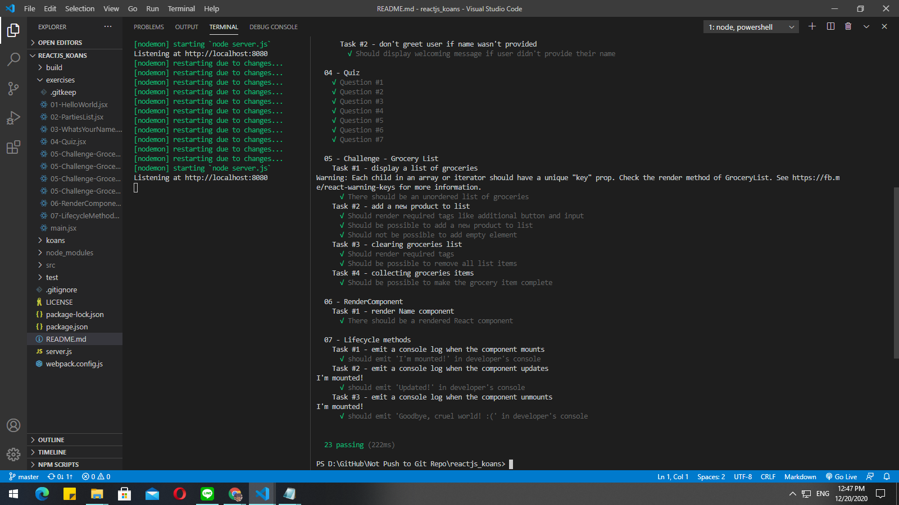
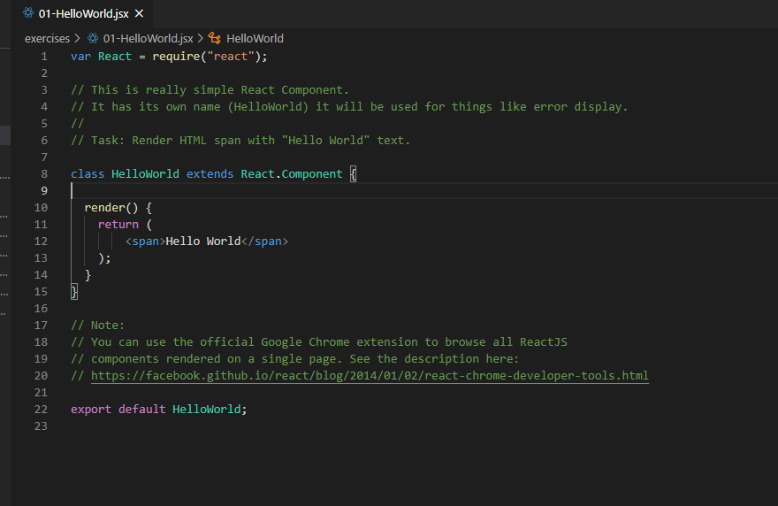
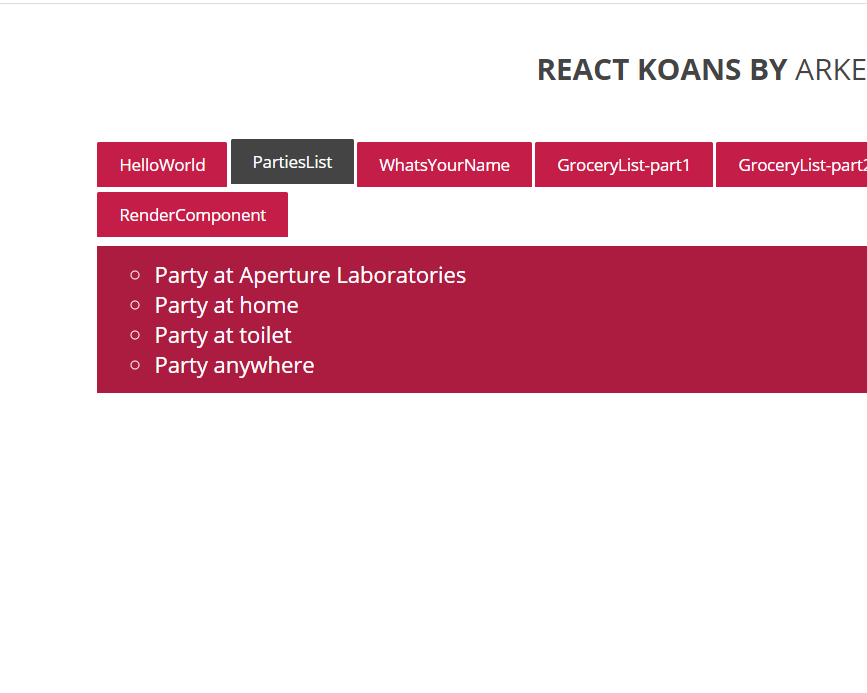
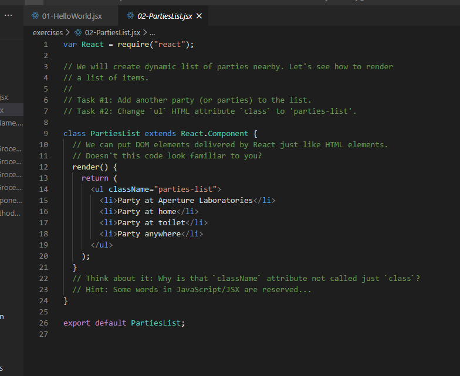
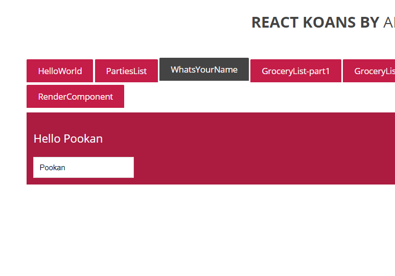
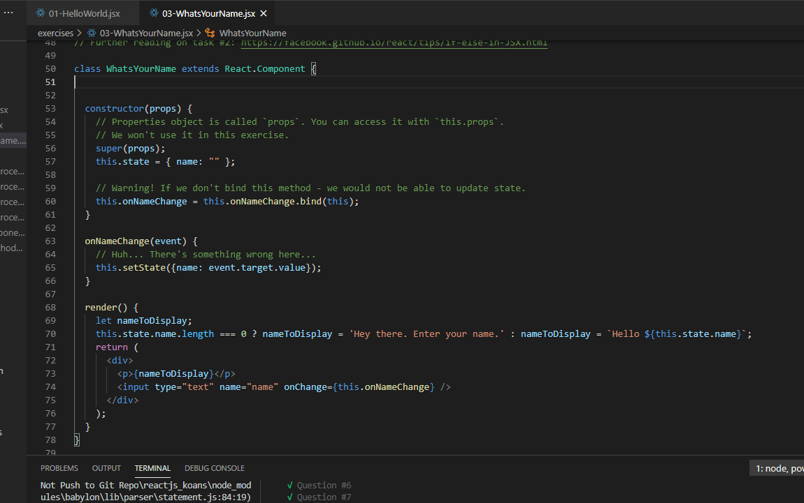
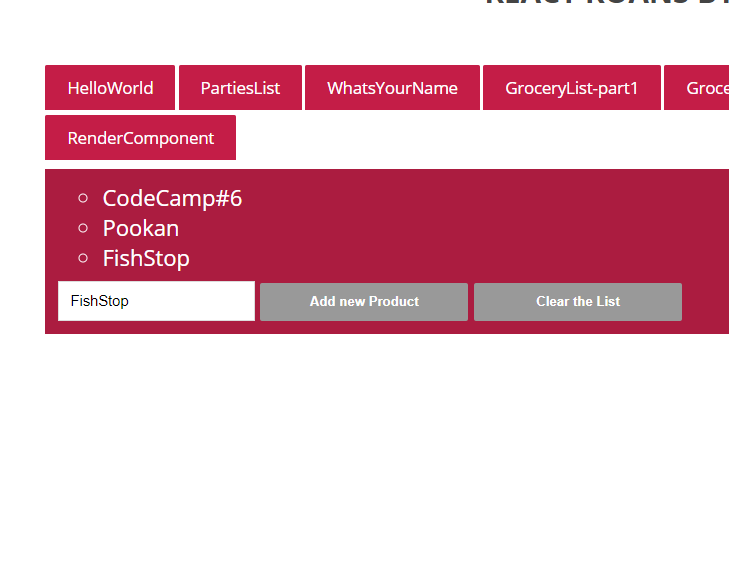
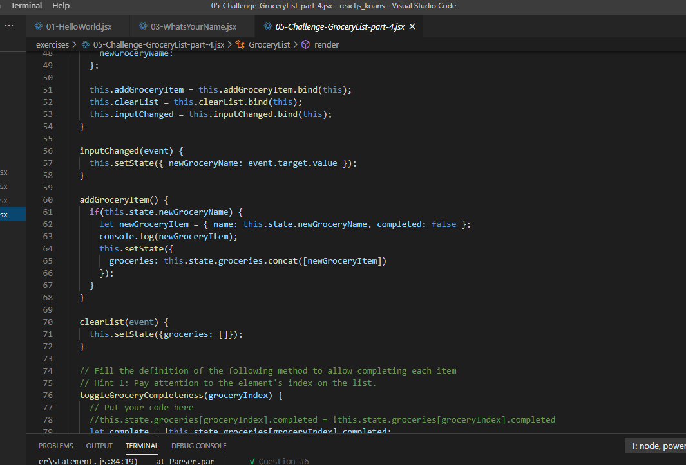
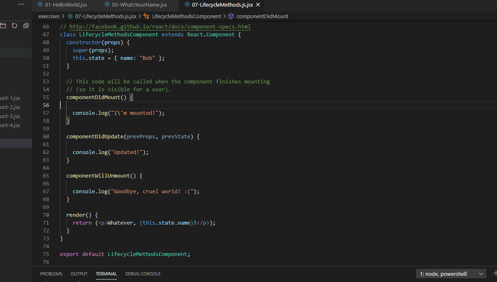

### React Koan

###### Hello Wordld!

  เรียนรู้การแสดงผลคำว่า Hello World ได้เรียนรู้ว่า react สามารถ render html tagได้

###### Render Multiple HTML tag

  เรียนรู้การแสดงผลเมื่อมีHTML tag มากกว่าหนึ่งอัน จะต้องหาTagอะไรก็ได้มาครอบไว้

###### State Change

  เรียนรู้การเปลี่ยนstateเพื่อแสดงผลตาม event listener เพื่อใช้ในการควบคุมการแสดงผล

###### Clear State and Child Component

  เรียนรู้การเปลี่ยนstateที่ใส่ไปแล้ว และการนำChild component เพื่อนำความรู้ดังกล่าวไปสร้างChild component เพื่อลดความซับซ้อนของ Parent component

###### Life Cycle method

  เรียนรู้การใช้ Life Cycle method สามารถนำไปใช้ในเรื่องของการfetchข้อมูลจากbackend เพื่อบังคับfetchตอนผู้ใช้เข้ามาครั้งแรก

